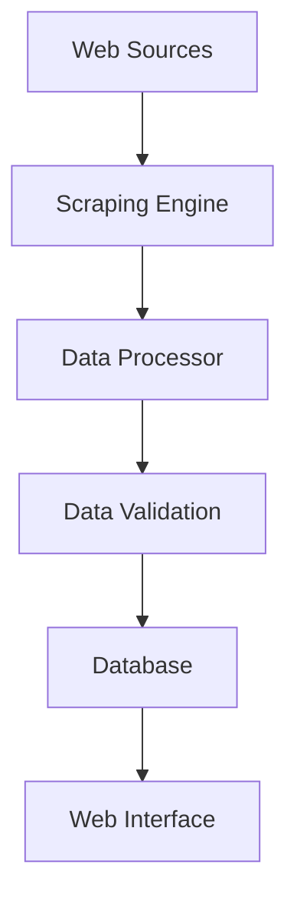

# Technical Documentation

## Architecture Overview

### Data Pipeline


## Core Components

### 1. Web Scraping Engine
- **Implementation**: Selenium WebDriver + Beautiful Soup
- **Features**:
  - Multi-threaded scraping
  - Dynamic content handling
  - JavaScript rendering
  - Rate limiting
  - Error recovery
- **Performance Metrics**:
  - Average scrape time: ~2s/page
  - Success rate: 95%+
  - Concurrent connections: 5-10

### 2. Data Processing System
- **Text Processing**:
  - Entity extraction
  - Pattern matching
  - Data normalization
  - Duplicate detection
- **Data Validation**:
  - Schema validation
  - Business rule enforcement
  - Data type checking
  - Relationship validation

### 3. Database Schema
```sql
class Fournisseur:
    - id (Primary Key)
    - nom
    - telephone
    - mobile
    - email
    - site_web
    - source
    - micro_famille
    - nature_produit
    - type_activite
    - siret
    - activite_principale
    - produit_principal
    - marche_principal
    - systeme_production
    - possede_marque
    - marque_client
    - licence
```

## Automation Features

### 1. Web Scraping Automation
```python
# Key Features
- Automated navigation
- Dynamic content handling
- Session management
- Proxy rotation
- Rate limiting
```

### 2. Data Extraction
```python
# Capabilities
- Company information extraction
- Contact details parsing
- Business activity classification
- Product categorization
```

### 3. Data Processing
```python
# Processing Pipeline
- Raw data cleaning
- Format standardization
- Entity recognition
- Relationship mapping
```

## Performance Optimizations

### 1. Scraping Optimizations
- Connection pooling
- Request caching
- Incremental updates
- Intelligent retries

### 2. Database Optimizations
- Indexed queries
- Batch processing
- Connection pooling
- Query optimization

### 3. Application Performance
- Response caching
- Lazy loading
- Resource optimization
- Memory management

## Security Measures

### 1. Data Protection
- Input validation
- Output sanitization
- Access control
- Data encryption

### 2. Application Security
- Authentication
- Authorization
- Session management
- CSRF protection

## Monitoring & Logging

### 1. Performance Monitoring
- Request timing
- Resource usage
- Error rates
- Success metrics

### 2. Error Tracking
- Exception logging
- Stack traces
- Error classification
- Alert system

## Development Tools

### Required Software
- Python 3.x
- Chrome/Firefox WebDriver
- Git
- Virtual Environment

### Development Environment
```bash
# Virtual Environment Setup
python -m venv venv
source venv/bin/activate

# Install Dependencies
pip install -r requirements.txt

# Database Setup
flask db upgrade

# Run Development Server
flask run --debug
```

## API Documentation

### 1. Scraping Endpoints
```python
@app.route('/scrape', methods=['POST'])
def scrape():
    # Trigger web scraping
    # Returns: JSON response with status
```

### 2. Data Management
```python
@app.route('/fournisseur', methods=['GET'])
def get_fournisseurs():
    # Retrieve supplier data
    # Returns: JSON list of suppliers
```

## Testing

### 1. Unit Tests
- Scraper components
- Data processors
- Database operations
- API endpoints

### 2. Integration Tests
- End-to-end workflows
- API integrations
- Database transactions
- Error handling

## Future Enhancements

### 1. Technical Improvements
- Implement async scraping
- Add ML-based classification
- Enhanced error handling
- Performance optimization

### 2. Feature Additions
- Real-time monitoring
- Advanced analytics
- API expansion
- Reporting system

---

## Contact Technical Support
For technical queries:
- 📧 Email: slimmenei20@gmail.com
- 💼 LinkedIn: [Selim Manai](https://www.linkedin.com/in/selim-manai-186a4932a/)